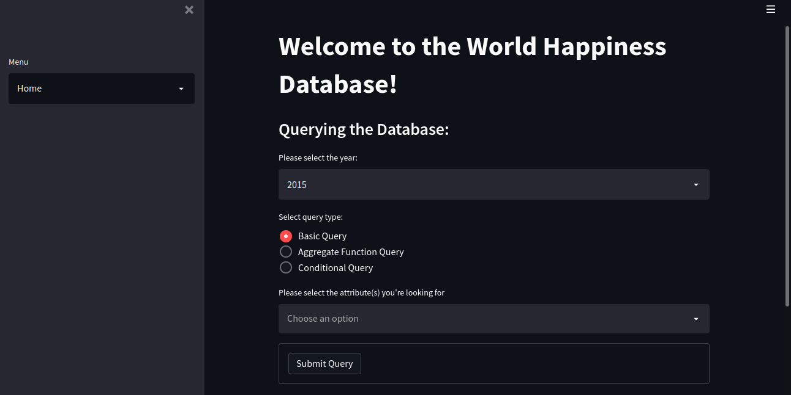
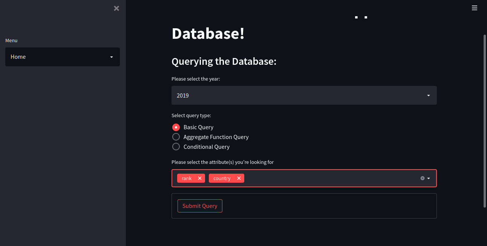
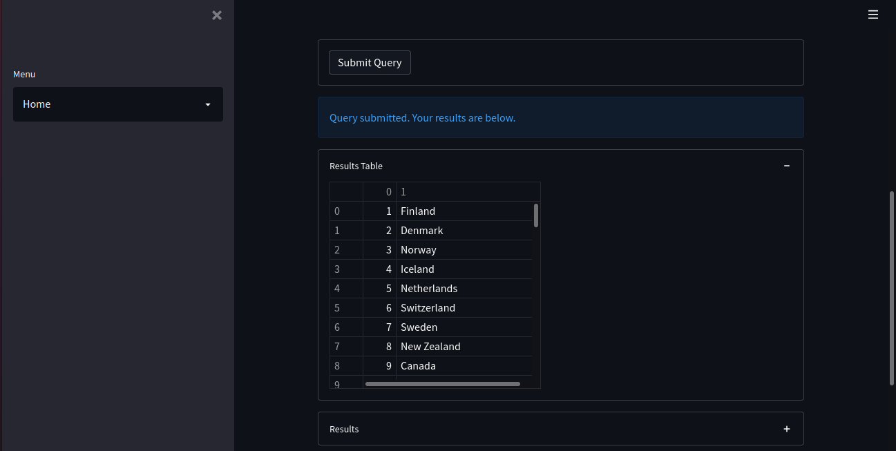
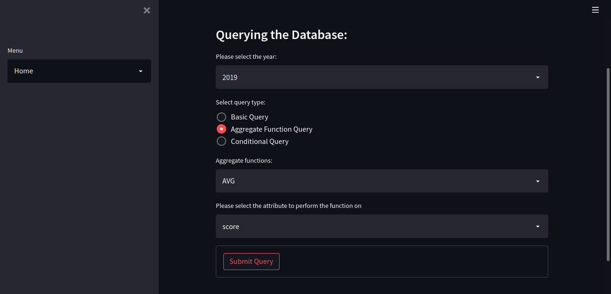
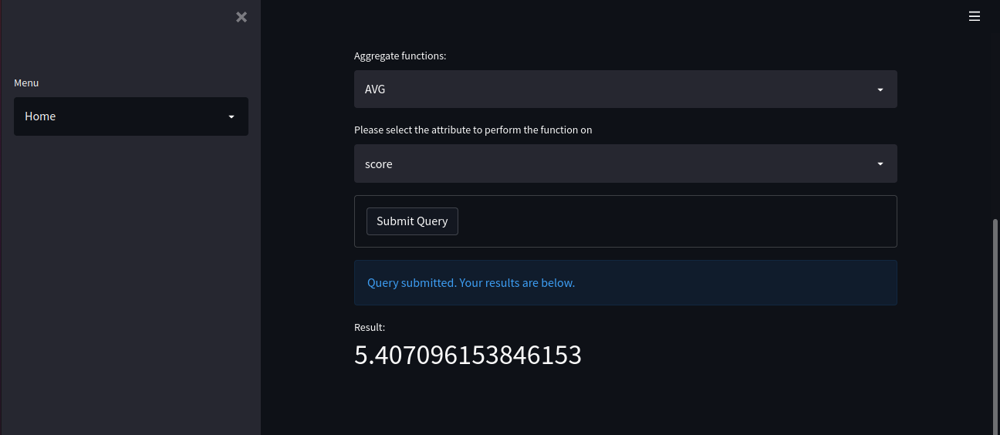
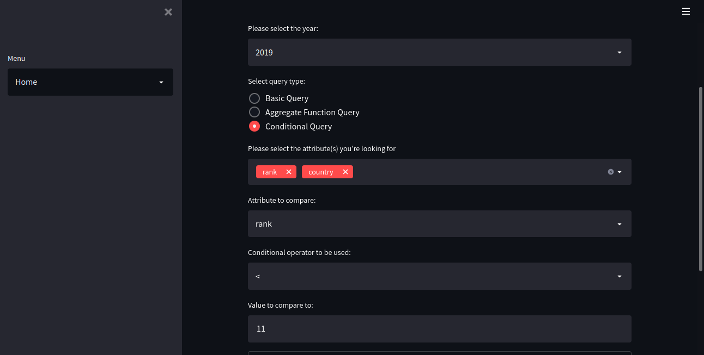
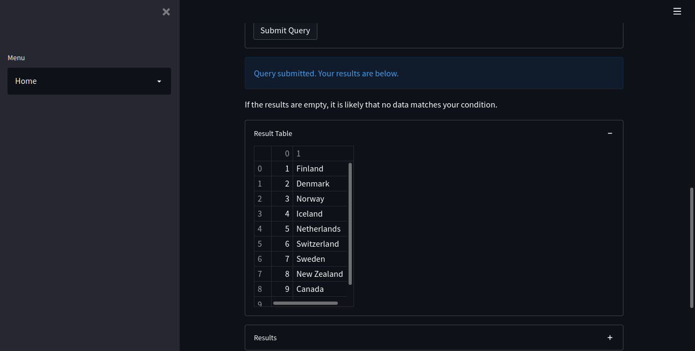

### cs312S2022


#### Names of group members

Katie Burgess

Paige Downey

Michael Abraham

#### Group Name

project-katie-paige-michael


#### Due Date: Project

18 May 2022

_Please note: no extensions are possible for this assignment._


#### Overview

 - Offer several screenshots of the system in use.

Homepage:



When selecting Basic Query in the query type section, the user will be able select specific attributes that they are looking for:



The results of the Basic Query will be displayed in a table which will be numbered from greatest to least:



When selecting Aggregate Query in the query type section, the user will be able to find things like average, minimum, maximum, and functions alike:



The results of the Aggregate Query will be displayed by a float that goes up to fifteen digits after the decimal point:



When selection Conditional Query in the query type section, the user will be able to compare values in a table to other values:



The results of the Aggregate Query will be displayed in a table which will be numbered from greatest to least. 



 - What is the title of this work?

 ```
 World Happiness Database Manager
 ```

 - Describe the software decision of your project. Why was this particular software selected?

 ```
 For this project, we decided to use Python and Streamlit to query an SQLite3 database. We chose to combine these with SQLite in order to develop a way for users to query the database without knowing any SQL. Streamlit provides a way to easily develop clean and clear front ends for those who are familiar with Python. Using Streamlit also cuts down on the time that users would have to spend typing if they were running SQL or another program in the terminal. The user's options are clearly laid out in front of them, and there is an About page available if the user needs additional explanation.
 ```

 - Which references used in this project to motivate your work.

 ```
 The main motive for this project was our experience with using Streamlit in class. In addition to referencing the code in the 16_21April2022_streamlitDBMS folder, we also referenced some Streamlit documentation.
 ```

Streamlit Docs: https://docs.streamlit.io/
Streamlit Cheat Sheet: https://docs.streamlit.io/library/cheatsheet

#### Data

 - What is the data for your project?

 ```
The data for our project is a recording of people's rates of happiness and a few other variables on a scale from 1 to 10. 
 ```

 - How was this data collected? Please name any biases that you anticipate.

 ```
This data was collected through a survey originally released at the United Nations for an event called the International Day of Happiness on March 20th. Biases that may be presented in the survey don't have a likelihood of coming up based on the source the survey comes from, but definitely isn't something that is completely absent from it. Biases would probably be related to the image of the United Nations and its influence on the world which can be reflected in modified rates.
 ```

 - Provide the citation of your dataset.

 ```
(https://www.kaggle.com/datasets/unsdsn/world-happiness)
 ```

#### Use

 - What are the intended applications of your database?

 ```
 The main intended application of our database is to use it in researching world happiness. By querying this data, a researcher may find interesting information about the happiness of the world's countries. Researchers may slo be interested in researching the values associated with the happiness scores of a country throughout the years. Another possible application of our database is for people to explore the data out of curiosity. This data is interesting and by providing an way to easily query it, users can easily explore it.
 ```

 - Who are the intended users of the database and its data?

 ```
 The intended users of this database are researchers or people with a curiosity about this data. This database is easily queried using the Streamlit frontend, allowing for a wider audience to be able to use it. It is worth keeping in mind the simplicity of this project can also be a limitation. Researchers who want to develop more advanced queries or visualizations will not benefit as much from this project.
 ```

 - What are the necessary skills that the users must have to work with the database?

 ```
 To work with our database, users simply need the skills to run the program in the terminal. These skills are also minimized as they can copy and paste the run command from the README file. Despite the database being SQL, the frontend of this project ensures that the user never has to know any SQL. This allows almost anyone to be able to use our database.
 ```

#### Ethics

 - Imagine that your database contained personal information that was collected to complement the present data it contains. What ethical concerns would there be if this database were released (voluntarily or involuntarily) to the public with this data?

 ```
In the event that the database contained personal information pertaining to the recorded responses from individuals, an ethical concern would probably be the recording of information like feeling of freedom and government trust. In countries where governments have more of a grip on civilization and how the civilization acts, this information may be dangerous to the people living there. The government would be able to look at who specifically has issues with the government based on their response and have the ability to take possible violent action against these people. 
 ```

 - What types of security would be necessary to prevent the above ethical concerns from becoming a reality?

 ```
In order to prevent this ethical concern a very simple solution would be to have the database record anonymous data. This way the database is able to be accessed without having names to the responses. 
 ```

 - Describe another form of security to recommend for the safety of the data.

 ```
Another security measure for this data would probably have to be not specify locations in countries in which the information was collected. The database records information based on country, meaning that it doesn't get specifically into what states in the country agree with or disagree with the recorded information. Knowing if there was a concentration of responses in a certain state is dangerous information for the people living there.
 ```

#### Research Questions

 - Provide the five research questions of this project, along with their queries and results. For each result, what can be understood by the result?

#### 1

 - Research question:

 ```
 What is the average happiness rating change from 2015 to 2019?
 ```

 - Query

 ```
 SELECT ((SUM(year2019.score) / count(year2019.country)) - (SUM(year2015.score) / count(year2015.country))) FROM year2015, year2019;
 ```

 - Partial output (up to ten rows of output)

 ```
 0.0313619766312083
 ```

 - What do we conclude from this result?

 ```
 Interestingly, you can conclude from this result that overall the world happiness level hasn't increased much at all over the span of 2015 to 2019. There may have been increases in the top few countries, but this means that there were decreases in happiness for other countries.
 ```

#### 2

 - Research question:

 ```
 Is trust in government going up over the years and is that correlated with freedom?
 ```

 - Query

 ```
 SELECT AVG(year2015.freedom), AVG(year2015.trust), AVG(year2016.freedom), AVG(year2016.trust), AVG(year2017.freedom), AVG(year2017.trust), AVG(year2018.freedom), AVG(year2018.trust), AVG(year2019.freedom), AVG(year2019.trust) FROM year2015, year2016, year2017, year2018, year2019;
 ```

 - Partial output (up to ten rows of output)

 ```
 0.428615023503083|0.143421897324783|0.370993885221275|0.137623753701114|0.408785918999275|0.123120222496965|0.454506288435719|0.111282046144715|0.392570532821343|0.11060257661715

 ```

 - What do we conclude from this result?

 ```
 From this result we can conclude that from 2015 to 2019 freedom and trust in the government have both gone down.
 ```

#### 3

 - Research question:

 ```
 Does a certain attribute contribute the most to the happiness score in 2019?
 ```

 - Query

 ```
SELECT AVG(economy), AVG(family), AVG(health), AVG(freedom), AVG(trust), AVG(generosity) FROM year2019;
 ```

 - Partial output (up to ten rows of output)

 ```
 0.905147435897436|1.2088141025641|0.72524358974359|0.392570512820513|0.110602564102564|0.184846153846154
 ```

 - What do we conclude from this result?

 ```
 The column with the most influence over happiness score is family. This suggests that when creating these scores, those in charge decided that familial bonds made the largest impact on happiness for people.
 ```


#### 4

 - Research question:

 ```
 What do countries with lower happiness scores have in common?
 ```

 - Query

 ```
 SELECT * FROM year2015, year2016, year2017, year2018, year2019 WHERE year2015.score < 4.5 and year2016.score < 4.5 and year2017.score < 4.5 and year2018.score < 4.5 and year2019.score < 4.5;
 ```

 - Partial output (up to ten rows of output)

 ```
 Sub-Saharan Africa|124|4.436|0.03947|0.45407|0.86908|0.35874|0.24232|0.17461|0.219|2.11773|Sri Lanka|Southern Asia|117|4.415|4.322|4.508|0.97318|0.84783|0.62007|0.50817|0.07964|0.46978|0.91681|India|122|4.31500005722046|4.37152201749384|4.25847809694707|0.792221248149872|0.754372596740723|0.455427616834641|0.469987004995346|0.231538489460945|0.0922268852591515|1.5191171169281|154|South Sudan|3.254|0.337|0.608|0.177|0.112|0.224|0.106|151|Yemen|3.38|0.287|1.163|0.463|0.143|0.108|0.077
Mauritania|Sub-Saharan Africa|124|4.436|0.03947|0.45407|0.86908|0.35874|0.24232|0.17461|0.219|2.11773|Sri Lanka|Southern Asia|117|4.415|4.322|4.508|0.97318|0.84783|0.62007|0.50817|0.07964|0.46978|0.91681|India|122|4.31500005722046|4.37152201749384|4.25847809694707|0.792221248149872|0.754372596740723|0.455427616834641|0.469987004995346|
 ```

 - What do we conclude from this result?

 ```
 From this result, we can conclude that countries with lower ratings tend to have similar scores in each category, suggesting that they on average do badly on the same metrics as each other.
 ```


#### 5

 - Research question:

 ```
 What is the change in happiness scores of specific countries over the years of recorded data?
 ```

 - Query

 ```
 SELECT year2015.country, year2015.score, year2016.score, year2017.score, year2018.score, year2019.score FROM year2015, year2016, year2017, year2018, year2019 WHERE year2015.country == year2016.country and year2016.country == year2017.country and year2017.country == year2018.country and year2018.country == year2019.country;
 ```

 - Partial output (up to ten rows of output)

 ```
Denmark|7.527|7.526|7.52199983596802|7.555|7.6
Switzerland|7.587|7.509|7.49399995803833|7.487|7.48
Iceland|7.561|7.501|7.50400018692017|7.495|7.494
Norway|7.522|7.498|7.53700017929077|7.594|7.554
Finland|7.406|7.413|7.4689998626709|7.632|7.769
Canada|7.427|7.404|7.31599998474121|7.328|7.278
Netherlands|7.378|7.339|7.3769998550415|7.441|7.488
New Zealand|7.286|7.334|7.31400012969971|7.324|7.307
Australia|7.284|7.313|7.28399991989136|7.272|7.228
Sweden|7.364|7.291|7.28399991989136|7.314|7.343
 ```

 - What do we conclude from this result?

 ```
 From this result we can conclude that the countries with higher happiness scores tend to become happier over time.
 ```

---

(Did you remember to add your name to the top?)
