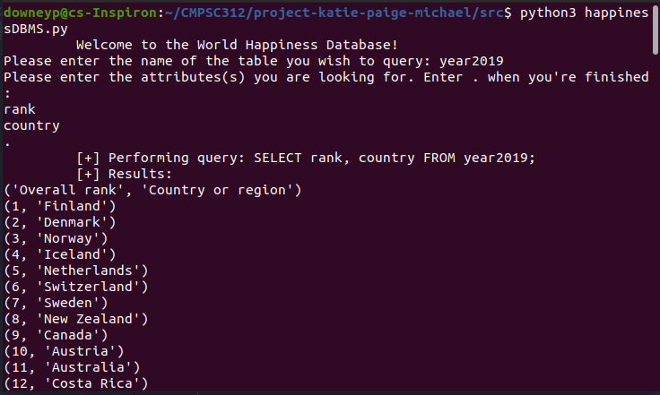

### cs312S2022

This file is to contain the status report for your work. Please see the assignment sheet for details. Please add your responses to this file.

####  Final Project: Update (counting as Exam 2)

#### Names of group members

Katie Burgess

Paige Downey

Michael Abraham

#### Group Name

project-katie-paige-michael

#### Due Date: Status Update (counting as Exam2 grade)

2 May 2022


 - What is the title of this work?

 ```
 World Happiness Database Manager
 ```

 - Data Reference:

 ```
 https://www.kaggle.com/datasets/unsdsn/world-happiness
 ```
#### Five Intellectual Research Questions of Scholarship

 - Question 1

 ```
 What is the overall happiness rating change from 2015 to 2019?
 ```

 - Question 2

 ```
 Is trust in government going up over the years and is that correlated with freedom?
 ```

 - Question 3

 ```
 Does a certain attribute contribute the most to the happiness score?
 ```

 - Question 4

 ```
What do countries with lower happiness scores have in common?
 ```

 - Question 5
 
 ```
What is the evident cause of change in happiness scores of specific countries over the years of recorded data?
 ```

#### Progress

- Steps I /we have taken already:

```
We currently have a builder file, the SQLite database, and Python code that can make SQL queries.
```

- Steps that I /we will take:

```
We still need to write the readme file, the report, and finished the Python file of the database manager. We intend on using Streamlit in the finished version of the code. We also still need to actually run the queries to answer our research questions.
```

#### Code Sample

- What is the submitted code and how does it help to accomplish the research goals of this project?

```
The current submitted code is a Python program that can perform queries on an SQL database. It currently has a user interface in the terminal, but this is only a temporary implementation that will be replaced by Streamlit. This currently code is to exercise the logic of performing queries.
```

 - Screenshots of submitted code in action.




---
(Did you remember to add your name to the top?)
